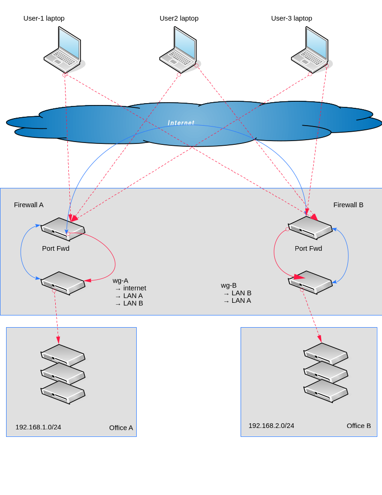

.. SPDX-License-Identifier: GPL-2.0-or-later

.. _Example_2:

Working Example 2
-----------------

This example builds on :ref:`Example_1` by adding second gateway.

The new gateway *wg-B* provides access to Office-B LAN, *192.168.2.0/24*.
Both gateways provide internet access and are visible on the internet. 

*wg-A* still offers access to  Office A LAN.

We walk through the steps :ref:`Example-2-tool` which leads to the
creation of the :ref:`Example-2-standard`.

Network Diagram
+++++++++++++++

user-1 and user-2's laptops can connect to both gateways and 
access both LANs. Their internet traffic will go through the vpn, providing
privacy. Their internet access could be one or the other gateway. 

Note that wireguard relies on the networks shown in the config files
to set up routing. It does not check nor provide a failover mechanism 
or any dynamic checks and adjustments.

In practice wireguard chooses the first peer offering a route to the internet
and stick with that. This happens when wireguard starts.

user-3 continues to use split routing, retaining direct internet access and using 
the gateways solely for LAN access to both office locations.

As in the previous example, we construct the goals table:

.. .. include:: ./latex-includes/latex-format.rst

Goals Table
+++++++++++

.. list-table:: Example 2 Goals
   :header-rows: 2

   * - 
     - 
     - 
     - Internet
     - 
     - Networks 
     - 
   * - Account
     - Profile
     - Gateway
     - wanted
     - offered
     - offered
     - wanted
   * - servers
     - wg-A
     - |ctron| ✓ |ctroff|
     - |ctron| ✗ |ctroff|
     - |ctron| ✓ |ctroff|
     - 192.168.1.0/24
     - 192.168.2.0/24
   * - servers
     - wg-B
     - |ctron| ✓ |ctroff|
     - |ctron| ✗ |ctroff|
     - |ctron| ✓ |ctroff|
     - 192.168.2.0/24
     - 192.168.1.0/24
   * - user-1
     - laptop
     - |ctron| ✗ |ctroff|
     - |ctron| ✓ |ctroff|
     - |ctron| ✗ |ctroff|
     - \-
     - 192.168.1.0/24
   * - 
     - 
     - 
     - 
     - 
     - 
     - 192.168.2.0/24
   * - user-2
     - laptop
     - |ctron| ✗ |ctroff|
     - |ctron| ✓ |ctroff|
     - |ctron| ✗ |ctroff|
     - \-
     - 192.168.1.0/24
   * - 
     - 
     - 
     - 
     - 
     - 
     - 192.168.2.0/24
   * - user-3
     - laptop
     - |ctron| ✗ |ctroff|
     - |ctron| ✗ |ctroff|
     - |ctron| ✗ |ctroff|
     - \-
     - 192.168.1.32/28
   * - 
     - 
     - 
     - 
     - 
     - 
     - 192.168.2.0/24

.. _Example-2-tool:

Generating the Wireguard Configs Using wg-tool
++++++++++++++++++++++++++++++++++++++++++++++

Next we create the wireguard configs above using wg-tool.
This will be quit a bit simpler than editing all those configs manually.

We build on what was done in Part 1 working in the same directory.

Add Second Gateway wg-B
^^^^^^^^^^^^^^^^^^^^^^^

Lets add the new gateway *wg-B*

.. code-block:: bash

   wg-tool --new vpn-test.servers.wg-B
   wg-tool --edit vpn-test.servers.wg-B

Edit the file as displayed, this time it will be *Edits/vpn-test.servers.wg-B.mods*.

As we did for *wg-A*, add an Endpoint for *wg-B*. 

.. code-block:: none

   Endpoint = "vpn_B.example.net:51820"]
   internet_offered = true
   post_up = ['/usr/bin/nft -f /etc/wireguard/scripts/postup.nft']
   post_down = ['/usr/bin/nft flush ruleset']

As before merge the changes back:

.. code-block:: bash

    wg-tool --merge Edits/vpn-test.servers.wg-B.mods

Network Access
^^^^^^^^^^^^^^

First lets set *wg-B* to offer Ofice B LAN network, *192.168.2.0/24*, and 
also give it access to the LAN offered by *wg-A* network. 

We'll also give *wg-A* access to this network, *192.168.2.0/24*.

I other words, each of the 2 gateways will have access to the LAN provided
by the other gateway.

Lets use the command line options to accomplish this.

.. code-block:: bash

   wg-tool --nets-offered-add "192.168.2.0/24" vpn-test.servers.wg-B
   wg-tool --nets-wanted-add "192.168.1.0/24" vpn-test.servers.wg-B

   wg-tool --nets-wanted-add "192.168.2.0/24" vpn-test.servers.wg-A

Next we add permission to *192.168.2.0/24* for all 3 user profiles.

.. code-block:: bash

   wg-tool --nets-wanted-add "192.168.2.0/24" vpn-test.user-1 vpn-test.user-2 vpn-test.user-3

Notice that we used *<vpn>.<account>* for the user IDs. This is a shortcut for every profile
belonging to *<vpn>.<account>*. In our case each user only has a single profile, laptop.
If there were more then, every profile would have this network added. 

You can add multiple networks using *--nets-wanted-add* by separating them with commas.
For example you can use "102.168.2.0/24,192.168.100.0/24" to add 2 networks.

Listing What We Have
^^^^^^^^^^^^^^^^^^^^

As we did in previous example, lets list everthing to confirm it has what we want.

.. code-block:: bash
    
    wg-tool -lv

Output should look similar to this:

.. code-block:: none

    ✓ vpn-test         250915-065904:

        ✓ servers      250915-093519:
                         ✓ wg-A                 250915-093526 (gateway)
                                         nets_offered : ['192.168.1.0/24', 'internet']
                                          nets_wanted : ['192.168.2.0/24']
                         ✓ wg-B                 250915-093526 (gateway)
                                         nets_offered : ['192.168.2.0/24', 'internet']
                                          nets_wanted : ['192.168.1.0/24']

        ✓ user-1       250915-065905:
                         ✓ laptop               250915-093526 
                                          nets_wanted : ['192.168.1.0/24', '192.168.2.0/24', 'internet']

        ✓ user-2       250915-065905:
                         ✓ laptop               250915-093526 
                                          nets_wanted : ['192.168.1.0/24', '192.168.2.0/24', 'internet']

        ✓ user-3       250915-065905:
                         ✓ laptop               250915-093526 
                                          nets_wanted : ['192.168.1.32/28', '192.168.2.0/24']

This shows both gateways sharing one another's networks
and the users have also gained access to *192.168.2.0/24*

*vpn-test.user-3.laptop* is still using split tunnelling.

As before, the resulting wireguard config files reside
under *Data-wg/vpn-test1*.

By now you may feel the list output above is sufficient to confirm things
are as intended, but for completeness we'll show the resulting wireguard
configs, as we did in the previous example.

The config for the 2 gateways *wg-A* and *wg-B* will be in:

.. code-block:: bash

   cat Data-wg/vpn-test/servers/wg-A.conf
   cat Data-wg/vpn-test/servers/wg-B.conf

while the 3 user acoounts and their laptop profiles will be found:

.. code-block:: none

    cat Data-wg/vpn-test/user-1/laptop.conf
    cat Data-wg/vpn-test/user-2/laptop.conf
    cat Data-wg/vpn-test/user-3/laptop.conf
    
These files should match what is shown below.

.. _Example-2-standard:

Standard Wireguard Configs
++++++++++++++++++++++++++

**wg-A**

.. code-block:: none

    [Interface]          # servers wg-A (gateway) 
        PrivateKey           = <privkey>
        ListenPort           = 51820
        Address              = 10.77.77.1/24, fc00:77:77::1/64
        PostUp               = /usr/bin/nft -f /etc/wireguard/scripts/postup.nft
        PostDown             = /usr/bin/nft flush ruleset

    #
    # Gateways
    #

    [Peer]               # servers wg-B (gateway) 
        PublicKey            = <pubkey wg-B>
        PresharedKey         = <psk wg-A x wg-B>
        AllowedIPs           = 10.77.77.5/32, 192.168.1.0/24, 192.168.2.0/24
        AllowedIPs           = fc00:77:77::5/128
        Endpoint             = vpn_B.example.com:51820

    #
    # Clients
    #

    [Peer]               # user-1 laptop  
        PublicKey            = <pubkey user-1.laptop>
        PresharedKey         = <psk wg-A x user-1.laptop>
        AllowedIPs           = 10.77.77.2/32, 192.168.1.0/24, fc00:77:77::2/128

    [Peer]               # user-2 laptop  
        PublicKey            = <pubkey user-2.laptop>
        PresharedKey         = <psk wg-A x user-2.laptop>
        AllowedIPs           = 10.77.77.3/32, 192.168.1.0/24, fc00:77:77::3/128

    [Peer]               # user-3 laptop  
        PublicKey            = <pubkey user-3.laptop>
        PresharedKey         = <psk wg-A x user-3.laptop>
        AllowedIPs           = 10.77.77.4/32, 192.168.1.0/24, fc00:77:77::4/128

**wg-B**

.. code-block:: none

    [Interface]          # servers wg-B (gateway) 
        PrivateKey           = <privkey>
        ListenPort           = 51820
        Address              = 10.77.77.5/24, fc00:77:77::5/64
        PostUp               = /usr/bin/nft -f /etc/wireguard/scripts/postup.nft
        PostDown             = /usr/bin/nft flush ruleset

    #
    # Gateways
    #

    [Peer]               # servers wg-A (gateway) 
        PublicKey            = <pubkey wg-A>
        PresharedKey         = <psk wg-B x wg-A>
        AllowedIPs           = 10.77.77.1/32, 192.168.1.0/24, 192.168.2.0/24
        AllowedIPs           = fc00:77:77::1/128
        Endpoint             = vpn_A.example.com:51820

    #
    # Clients
    #

    [Peer]               # user-1 laptop  
        PublicKey            = <pubkey user-1.laptop>
        PresharedKey         = <psk wg-B x user-1.laptop>
        AllowedIPs           = 10.77.77.2/32, 192.168.2.0/24, fc00:77:77::2/128

    [Peer]               # user-2 laptop  
        PublicKey            = <pubkey user-2.laptop>
        PresharedKey         = <psk wg-B x user-2.laptop>
        AllowedIPs           = 10.77.77.3/32, 192.168.2.0/24, fc00:77:77::3/128

    [Peer]               # user-3 laptop  
        PublicKey            = <pubkey user-3.laptop>
        PresharedKey         = <psk wg-B x user-3.laptop>
        AllowedIPs           = 10.77.77.4/32, 192.168.2.0/24, fc00:77:77::4/128

**user-1**

.. code-block::  none

    [Interface]          # user-1 laptop  
        PrivateKey           = <privkey>
        Address              = 10.77.77.2/32, fc00:77:77::2/128
        DNS                  = 10.10.10.10

    #
    # Gateways
    #

    [Peer]               # servers wg-B (gateway) 
        PublicKey            = <pubkey wg-B>
        PresharedKey         = <psk wg-B x user-1.laptop>
        # pre-compacted        0.0.0.0/0, 10.77.77.5/32, 192.168.2.0/24
        # pre-compacted        ::/0, fc00:77:77::5/128
        AllowedIPs           = 0.0.0.0/0, ::/0
        Endpoint             = vpn_B.example.com:51820

    [Peer]               # servers wg-A (gateway) 
        PublicKey            = <pubkey wg-A>
        PresharedKey         = <psk wg-A x user-1.laptop>
        # pre-compacted        0.0.0.0/0, 10.77.77.1/32, 192.168.1.0/24
        # pre-compacted        ::/0, fc00:77:77::1/128
        AllowedIPs           = 0.0.0.0/0, ::/0
        Endpoint             = vpn_A.example.com:51820

**user-2**

.. code-block::  none

    [Interface]          # user-2 laptop  
        PrivateKey           = <privkey>
        Address              = 10.77.77.3/32, fc00:77:77::3/128
        DNS                  = 10.10.10.10

    #
    # Gateways
    #

    [Peer]               # servers wg-B (gateway) 
        PublicKey            = <pubkey wg-B>
        PresharedKey         = <psk wg-B x user-2.laptop>
        # re-compacted        0.0.0.0/0, 10.77.77.5/32, 192.168.2.0/24
        # re-compacted        ::/0, fc00:77:77::5/128
        AllowedIPs           = 0.0.0.0/0, ::/0
        Endpoint             = vpn_B.example.com:51820

    [Peer]               # servers wg-A (gateway) 
        PublicKey            = <pubkey wg-A>
        PresharedKey         = <psk wg-A x user-2.laptop>
        # pre-compacted        0.0.0.0/0, 10.77.77.1/32, 192.168.1.0/24
        # pre-compacted        ::/0, fc00:77:77::1/128
        AllowedIPs           = 0.0.0.0/0, ::/0
        Endpoint             = vpn_A.example.com:51820

**user-3**

.. code-block:: none 

    [Interface]          # user-3 laptop  
        PrivateKey           = <privkey>
        Address              = 10.77.77.4/32, fc00:77:77::4/128
        DNS                  = 10.10.10.10

    #
    # Gateways
    #
    [Peer]               # servers wg-B (gateway) 
        PublicKey            = <pubkey wg-B>
        PresharedKey         = <psk wg-B x user-3.laptop>
        AllowedIPs           = 10.77.77.5/32, 192.168.2.0/24, fc00:77:77::5/128
        Endpoint             = vpn_B.example.com:51820

    [Peer]               # servers wg-A (gateway) 
        PublicKey            = <pubkey wg-A>
        PresharedKey         = <psk wg-A x user-3.laptop>
        AllowedIPs           = 10.77.77.1/32, 192.168.1.0/24, fc00:77:77::1/128
        Endpoint             = vpn_A.example.com:51820

.. include:: ./Example-3.rst

