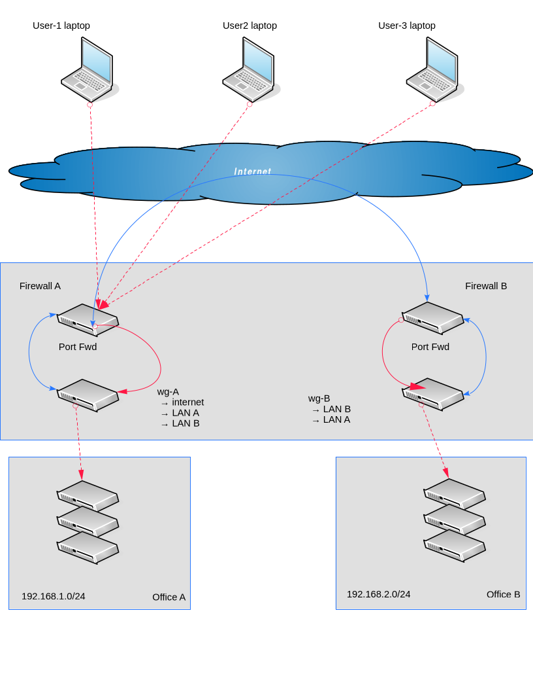
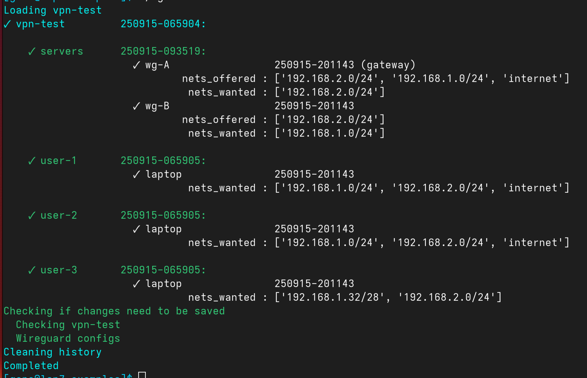

.. SPDX-License-Identifier: GPL-2.0-or-later

Working Example 3
-----------------

This example makes one small modification to :ref:`Example_2`. 

*wg-B* is changed to be a client instead of a gateway.

This means it no longer has its own *Endpoint*.
It continues to offer access to the Office B LAN but now
provides it to *wg-A* which in turn will share it with it's clients.

This situation can occur when there are 2 locations, one of them 
has a public IP address (*wg-A*) while the other one (*wg-B*) does not.
Now *wg-B* can connect to *wg-A* as a client, providing access to it's LAN,
while *wg-A* offers its LAN to *wg-B*.

The road warrier laptops can only connect to *wg-A* and they all 
want to have access to both LANs.

Network Diagram
+++++++++++++++

*wg-B* will be a peer of *wg-A* and offer access to Office B's LAN. 
However clients will now access this LAN via *wq-A*.

Simple change to the goals, but quite a few changes to the wireguard configs. 

When a gateway offers local networks
it is straightfoward to make them available to clients. In this case, clients need to
be informed that both Office A LAN and Office B LAN are available from gateway *wg-A*.

As before build the goals table:

Goals Table
+++++++++++

.. list-table:: Example 3: vpn-test
   :header-rows: 2

   * - 
     - 
     - 
     - Internet
     - 
     - Networks 
     - 
   * - Account
     - Profile
     - Gateway
     - wanted
     - offered
     - offered
     - wanted
   * - servers
     - wg-A
     - |ctron| ✓ |ctroff|
     - |ctron| ✗ |ctroff|
     - |ctron| ✓ |ctroff|
     - 192.168.1.0/24
     - 192.168.2.0/24
   * - 
     - 
     - 
     - 
     - 
     - 192.168.2.0/24
     - 
   * - servers
     - wg-B
     - |ctron| ✗ |ctroff|
     - |ctron| ✗ |ctroff|
     - |ctron| ✗ |ctroff|
     - 192.168.2.0/24
     - 192.168.1.0/24
   * - user-1
     - laptop
     - |ctron| ✗ |ctroff|
     - |ctron| ✓ |ctroff|
     - |ctron| ✗ |ctroff|
     - \-
     - 192.168.1.0/24
   * - 
     - 
     - 
     - 
     - 
     - 
     - 192.168.2.0/24
   * - user-2
     - laptop
     - |ctron| ✗ |ctroff|
     - |ctron| ✓ |ctroff|
     - |ctron| ✗ |ctroff|
     - \-
     - 192.168.1.0/24
   * - 
     - 
     - 
     - 
     - 
     - 
     - 192.168.2.0/24
   * - user-3
     - laptop
     - |ctron| ✗ |ctroff|
     - |ctron| ✗ |ctroff|
     - |ctron| ✗ |ctroff|
     - \-
     - 192.168.1.32/28
   * - 
     - 
     - 
     - 
     - 
     - 
     - 192.168.2.0/24

Generating the Wireguard Configs Using wg-tool
++++++++++++++++++++++++++++++++++++++++++++++

As in the previous two examples, we create the wireguard configs 
using wg-tool. We are going to make a small edit to *wg-B* to achieve this.

.. code-block:: bash

   wg-tool --edit vpn-test.servers.wg-B

Edit the file as before, (*Edits/vpn-test.servers.wg-B.mods*).
The only change needed is to set *Endpoint* to an empty string
and change *internet_offered* to false

.. code-block:: none

   Endpoint = ""
   internet_offered = false

Merge the changes:

.. code-block:: bash

    wg-tool --merge Edits/vpn-test.servers.wg-B.mods

Since *wg-B* can no longer provide access to other clients, we let *wg-A* 
do that on it's behalf:

.. code-block:: bash

   wg-tool --nets-offered-add  '192.168.2.0/24' vpn-test.servers.wg-A

That should be all that is necessary, *wg-tool* will do the rest.

List what we have:

.. code-block:: bash

   wg-tool -lv

The only real difference in the listing is that *wg-B* is no longer showing
as a gateway. It isn't of course, its just another peer at this point.
However, it still provides access to the *192.168.2.0/24* network.

Here's a terminal screen shot of the output:

As you can see in the verbose list output, *wg-B* is no longer a gateway. It offers
access to Office B LAN as a client to *wg-A*. It also *wants* access to Office A LAN.

All laptops want access to both networks which they now get from *wg-A*.

If you look at the wireguard configs you will see that the laptops now get both
networks from *wg-A*.

.. code-block:: bash

   cat Data-wg/vpn-test/servers/wg-A.conf
   cat Data-wg/vpn-test/servers/wg-B.conf
   cat Data-wg/vpn-test/user-1/laptop.conf
   cat Data-wg/vpn-test/user-2/laptop.conf
   cat Data-wg/vpn-test/user-3/laptop.conf
    

You will see that *wg-B* now has just one peer which is *wg-A*.
Furthermore, *wg-A* now allows *192.168.1.0/24* as well as *192.168.2.0/24* to it's 
clients. Finally, all the laptop clients now have both LANs listed in each
*AllowedIPs* with *wg-A*.

Previously, each laptop had LAN A listed for *wg-A* and LAN B for *wg-B*.

If we want to go back with *wg-B* again being a full gateway, then we just
edit *wg-B* and restore it's Endpoint and, if desired,  allow it to offer 
internet access as well.

.. code-block:: none

   Endpoint = "vpn_B.example.net:51820"
   internet_offered = true

Merge changes back and everything is back to the way it was in :ref:`Example_2`.

.. _Example-3-standard:

Standard Wireguard Configs
++++++++++++++++++++++++++

The basic set up is same as example 2. The only thing we're changing, at 
least superficially, is that *wg-B* is no longer a gateway; it's now another client.

This alsop means other client configs must be changed that they know to access
Office B LAN from *wg-A* instead of *wg-B*, as before. 

We must also change *wg-B* to remove the Endpoint while still offering
LAN-B access.

**wg-A**

* Note that the Peer section for *wg-B* no longer has an Endpoint

.. code-block:: none

    [Interface]          # servers wg-A (gateway) 
        PrivateKey           = <privkey>
        ListenPort           = 51820
        Address              = 10.77.77.1/24, fc00:77:77::1/64
        PostUp               = /usr/bin/nft -f /etc/wireguard/scripts/postup.nft
        PostDown             = /usr/bin/nft flush ruleset

    #
    # Clients
    #

    [Peer]               # servers wg-B  
        PublicKey            = <pubkey wg-B>
        PresharedKey         = <psk wg-A x wg-B>
        AllowedIPs           = 10.77.77.5/32, 192.168.1.0/24, 192.168.2.0/24
        AllowedIPs           = fc00:77:77::5/128

    [Peer]               # user-1 laptop  
        PublicKey            = <pubkey user-1.laptop>
        PresharedKey         = <psk wg-A x user-1.laptop>
        AllowedIPs           = 10.77.77.2/32, 192.168.1.0/24, 192.168.2.0/24
        AllowedIPs           = fc00:77:77::2/128

    [Peer]               # user-2 laptop  
        PublicKey            = <pubkey user-2.laptop>
        PresharedKey         = <psk wg-A x user-2.laptop>
        AllowedIPs           = 10.77.77.3/32, 192.168.1.0/24, 192.168.2.0/24
        AllowedIPs           = fc00:77:77::3/128

    [Peer]               # user-3 laptop  
        PublicKey            = <pubkey user-3.laptop>
        PresharedKey         = <psk wg-A x user-3.laptop>
        AllowedIPs           = 10.77.77.4/32, 192.168.1.32/28, 192.168.2.0/24
        AllowedIPs           = fc00:77:77::4/128

**wg-B**

* Client not a gateway
* ListenPort is removed from the Interface section, 
* provides access to LAN B
* there are no longer any user laptop sections

.. code-block:: none 

    [Interface]          # servers wg-B  
        PrivateKey           = <privkey>
        Address              = 10.77.77.5/32, fc00:77:77::5/128
        DNS                  = 10.10.10.10
        PostUp               = /usr/bin/nft -f /etc/wireguard/scripts/postup.nft
        PostDown             = /usr/bin/nft flush ruleset

    #
    # Gateways
    #

    [Peer]               # servers wg-A (gateway) 
        PublicKey            = <pubkey wg-A>
        PresharedKey         = <psk wg-A x wg-B>
        AllowedIPs           = 10.77.77.1/32, 192.168.1.0/24, 192.168.2.0/24
        AllowedIPs           = fc00:77:77::1/128
        Endpoint             = vpn_A.example.com:51820

**user-1**

* Note *wg-B* has been removed from all laptop clients and Office B LAN now provided by *wg-A*

.. code-block:: none 

    [Interface]          # user-1 laptop  
        PrivateKey           = <privkey>
        Address              = 10.77.77.2/32, fc00:77:77::2/128
        DNS                  = 10.10.10.10

    #
    # Gateways
    #

    [Peer]               # servers wg-A (gateway) 
        PublicKey            = <pubkey wg-A>
        PresharedKey         = <psk wg-A x user-1.laptop>
        # pre-compacted        0.0.0.0/0, 10.77.77.1/32, 192.168.1.0/24
        # pre-compacted        192.168.2.0/24, ::/0, fc00:77:77::1/128
        AllowedIPs           = 0.0.0.0/0, ::/0
        Endpoint             = vpn_A.example.com:51820

**user-2**

.. code-block:: none 

    [Interface]          # user-2 laptop  
        PrivateKey           = <privkey>
        Address              = 10.77.77.3/32, fc00:77:77::3/128
        DNS                  = 10.10.10.10

    #
    # Gateways
    #

    [Peer]               # servers wg-A (gateway) 
        PublicKey            = <pubkey wg-A>
        PresharedKey         = <psk wg-A x user-2.laptop>
        # pre-compacted        0.0.0.0/0, 10.77.77.1/32, 192.168.1.0/24
        # pre-compacted        192.168.2.0/24, ::/0, fc00:77:77::1/128
        AllowedIPs           = 0.0.0.0/0, ::/0
        Endpoint             = vpn_A.example.com:51820

**user-3**

.. code-block::  none

    [Interface]          # user-3 laptop  
        PrivateKey           = <privkey>
        Address              = 10.77.77.4/32, fc00:77:77::4/128
        DNS                  = 10.10.10.10

    #
    # Gateways
    #

    [Peer]               # servers wg-A (gateway) 
        PublicKey            = <pubkey wg-A>
        PresharedKey         = <psk wg-A x user-3.laptop>
        AllowedIPs           = 10.77.77.1/32, 192.168.1.32/28, 192.168.2.0/24
        AllowedIPs           = fc00:77:77::1/128
        Endpoint             = vpn_A.example.com:51820

